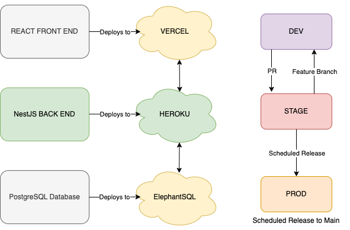

<h1>MLB Survivor Game (Server Repo)</h1>

**Overview:**
<i>This repository contains the server side logic, written in Node.js, for the MLB Survivor Game.  It serves as an API to a React Front End.</i>

**Technologies Used:**
<h3>Server Side Technology Stack: </h3>
<li> Node.js
<li> TypeScript
<li>Nest.JS - Primary Framework
<li> TypeORM - Database Interaction
<li> Jest - Unit Testing
<li> PostgreSQL - Database Management 
  

<h3>Branching Strategy and Deployment Listing:

  
MLBSG Developers:
  
Adam C. MacKinnon
<li> Nest.JS Back End Development
<li> Database Management
<li> DevOps/Release Management
  
Chris Owens
<li> React.JS Front End Development
<li> Front End Support